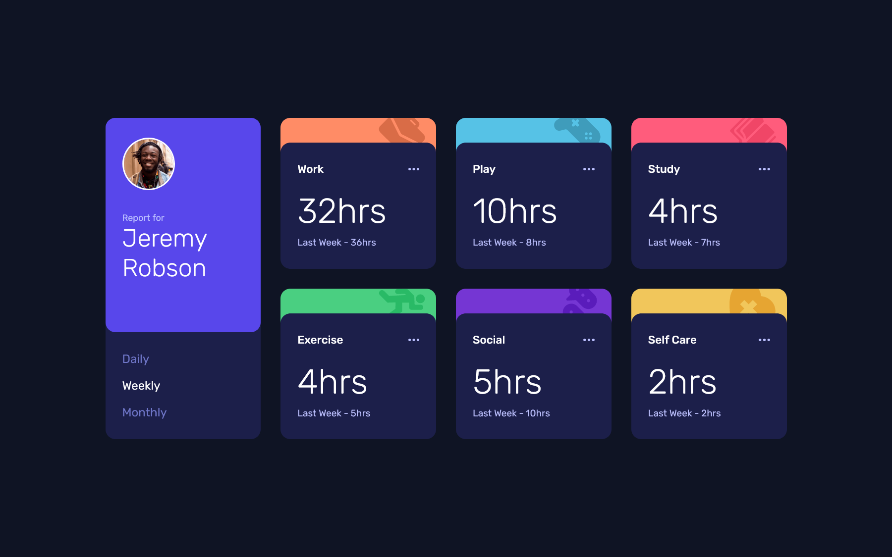

# Frontend Mentor - Time tracking dashboard solution

This is a solution to the [Time tracking dashboard challenge on Frontend Mentor](https://www.frontendmentor.io/challenges/time-tracking-dashboard-UIQ7167Jw). Frontend Mentor challenges help you improve your coding skills by building realistic projects. 

## Table of contents

- [Overview](#overview)
  - [Screenshot](#screenshot)
  - [Links](#links)
- [My process](#my-process)
  - [Built with](#built-with)
- [Author](#author)

## Overview

### Screenshot

### Links

- Live Site URL: [https://spectacular-beignet-efd2d2.netlify.app/](https://spectacular-beignet-efd2d2.netlify.app/)

## My process

### Built with

- Semantic HTML5 markup
- CSS custom properties
- Preprocessor SCSS
- JavaScript
- React

## Author

- Frontend Mentor - [@StinkyCodeMACHINE](https://www.frontendmentor.io/profile/StinkyCodeMACHINE)
